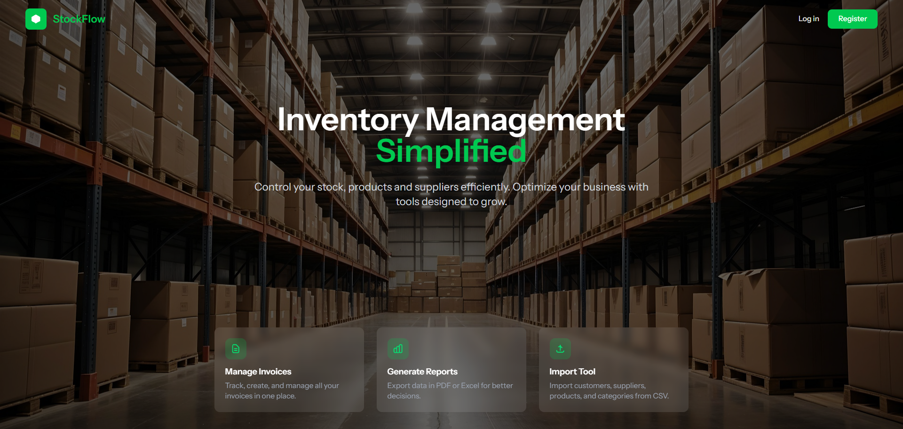
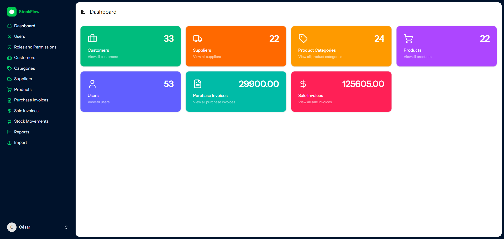
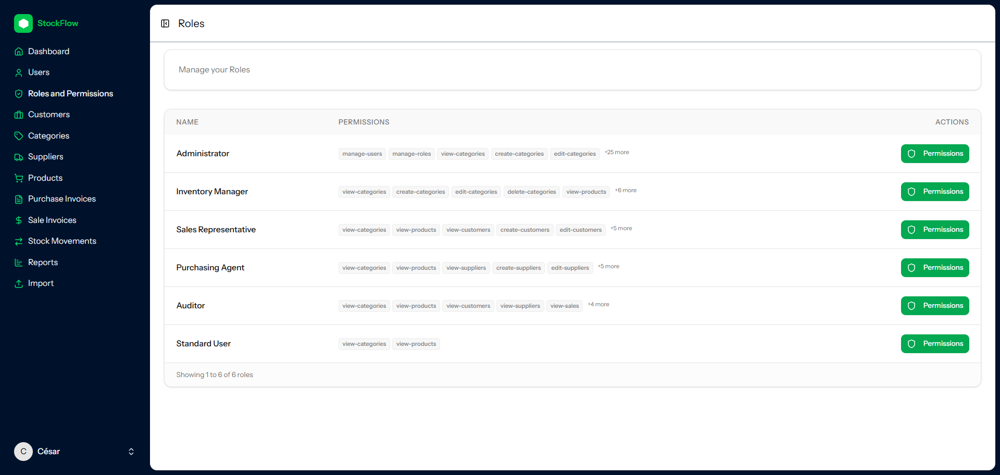
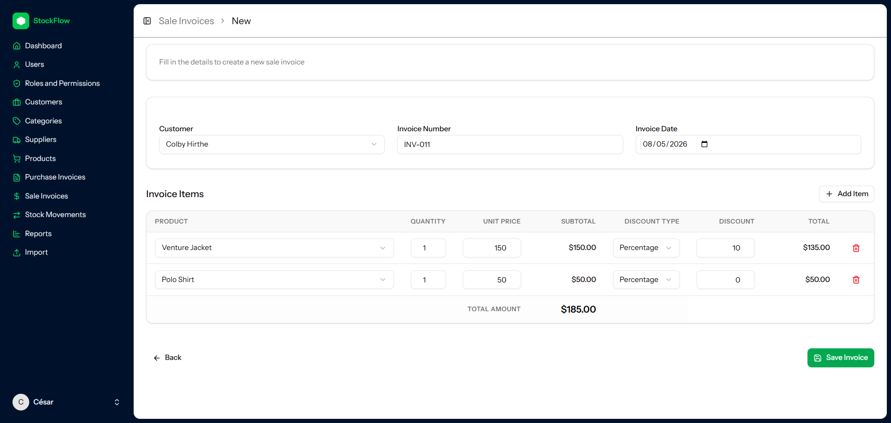
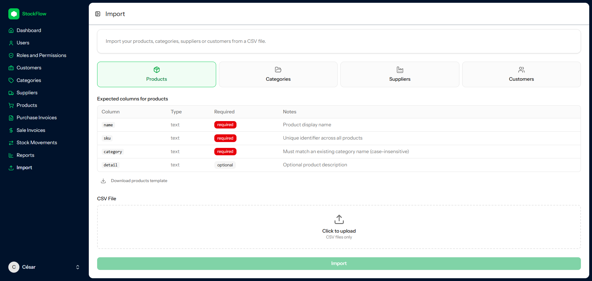

# Inventory Management System

A full-stack inventory management application built with **Laravel 13** and **React 19**.

Designed around real business workflows:
- purchase and sale invoices
- transactional stock handling
- role-based access control
- reporting and exports
- bulk import tooling

The project focuses heavily on backend architecture, concurrency safety, maintainability, and reusable frontend abstractions.


---

## Screenshots







---

## Why I built this

I wanted to design an inventory system focused on real-world engineering challenges rather than basic CRUD scaffolding.

The project emphasizes:
- transactional consistency
- concurrency-safe stock validation
- scalable frontend abstractions
- clean separation of concerns
- extensible domain architecture
- maintainable business logic

Instead of treating inventory as a simple counter, stock is derived from immutable ledger-style movement records, allowing full traceability and safer concurrent operations.

---

## Features

- **Catalog management** — full CRUD for categories, products, customers, and suppliers
- **Purchase & sale invoices** — invoice operations generate stock movement records automatically
- **Role and permission management** — RBAC using database-driven permissions
- **Reporting** — purchase, sales, and profit reports exportable as Excel or PDF
- **Bulk import tool** — CSV imports for products, categories, customers, and suppliers
- **Soft deletes** — recoverable entities with preserved historical integrity
- **2FA authentication** — Laravel Fortify integration

---

## Engineering highlights

### Transactional service layer

Business logic lives in dedicated service classes (`SaleInvoiceService`, `PurchaseInvoiceService`) instead of controllers.

- Controllers remain thin and HTTP-focused
- Services orchestrate multi-step business operations
- Invoice persistence and stock writes run inside a single `DB::transaction`
- Validation, authorization, and response shaping are delegated to specialized layers:
    - Form Requests
    - Policies / Gates
    - API Resources
    - Action classes

---

### Concurrency-safe stock validation

Stock availability is validated inside the database transaction to prevent race conditions.

- Current stock is calculated from the `stock_movements` ledger
- Rows are locked using `lockForUpdate()`
- Concurrent requests cannot oversell inventory
- Invoice updates exclude their own movements from validation to avoid false negatives

This guarantees consistency even under simultaneous requests.

---

### Ledger-based inventory system

Stock is not stored as a mutable counter.

Instead, inventory is derived from immutable stock movement records.

Benefits:
- Full inventory traceability
- Auditable history
- Easier debugging
- Reduced risk of stock desynchronization

---

### Polymorphic stock movements

`StockMovement` uses Laravel polymorphic relationships (`morphTo` / `morphMany`) to support multiple document types.

Current implementations:
- `SaleInvoice`
- `PurchaseInvoice`

New stock-affecting documents can be added without schema changes.

---

### Enum-driven invoice lifecycle

Invoice states are modeled as a PHP 8.3 enum (`InvoiceStatus`) instead of plain strings.

Available states:
- `CREATED`
- `CONFIRMED`
- `CANCELLED`

This provides:
- Type safety
- Explicit state transitions
- Better IDE support
- Reduced invalid-state bugs

---

### Reusable frontend CRUD architecture

Frontend CRUD behavior is abstracted into reusable hooks.

#### `useResourceCrud`

Centralizes:
- modal state
- form state
- create/update/delete flows

#### `useFilters`

Handles:
- filter state
- URL synchronization
- pagination

As a result, page components stay focused on presentation and table definitions rather than state orchestration.

---

### Factory Method import system

Imports are resolved dynamically through `ImportFactory::make($type)`.

Each importable entity has its own handler class:
- Products
- Categories
- Customers
- Suppliers

Adding a new import type requires:
1. Creating a handler
2. Registering it in the factory

No controller changes are needed.

---

### Role-Based Access Control (RBAC)

Permissions are database-driven using Spatie Laravel Permission.

Backend enforcement:
- Gates
- Policies
- Route middleware

Frontend enforcement:
- `usePermission` hook
- Declarative `<Gate>` component

Unauthorized actions remain visible but disabled, preserving UI consistency while reflecting backend authorization rules.

---

### Soft delete strategy

Core entities support soft deletes:
- Products
- Customers
- Categories
- Suppliers

This preserves:
- historical records
- foreign key integrity
- auditability

---

## Tech stack

### Backend

- Laravel 13
- PHP 8.3
- Inertia.js
- Spatie Laravel Permission
- Laravel Fortify
- Maatwebsite Excel
- Barryvdh DomPDF

### Frontend

- React 19
- TypeScript 5.7
- Inertia.js
- Tailwind CSS 4
- Radix UI
- Lucide React
- Sonner
- Vite

### Tooling

- PHPUnit
- Laravel Pint
- ESLint
- Prettier

---

## Project structure

The backend follows a layered architecture where each layer has a single responsibility.

```text
app/
├── Actions/              # Single-purpose query and command objects
│   ├── SaleInvoice/
│   └── User/
├── Services/             # Transactional business logic
│   ├── SaleInvoice/
│   └── PurchaseInvoice/
├── Http/
│   ├── Controllers/      # Thin HTTP layer
│   ├── Requests/         # Validation + authorization
│   └── Resources/        # API response shaping
├── Models/
│   └── StockMovement.php # Polymorphic inventory ledger
└── Enums/
    └── InvoiceStatus.php

resources/js/
├── pages/
├── components/
│   ├── ui/
│   ├── shared/
│   └── [entity]/
└── hooks/
    ├── use-resource-crud
    └── use-filters
```

---

## Getting started

### Prerequisites

- PHP 8.3+
- Node.js 20+
- Composer
- SQLite, MySQL, or PostgreSQL

### Installation

```bash
composer install
npm install

cp .env.example .env

php artisan key:generate
php artisan migrate

npm run build
npm run dev
```

---

## Available scripts

### Frontend

```bash
npm run dev           # Vite dev server
npm run build         # Production build
npm run lint          # ESLint autofix
npm run format        # Prettier formatting
npm run types:check   # TypeScript validation
```

### Backend

```bash
composer test         # PHPUnit
composer lint         # Laravel Pint
composer ci:check     # Full CI checks
```

---

## License

MIT